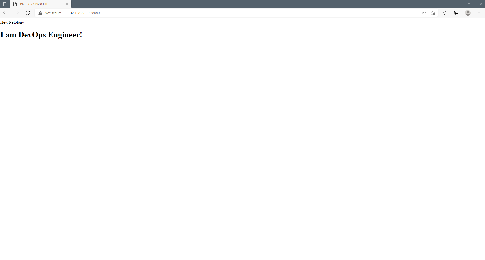

# Домашнее задание к занятию "5.3. Введение. Экосистема. Архитектура. Жизненный цикл Docker контейнера"

---

## Задача 1

Сценарий выполения задачи:

- создайте свой репозиторий на https://hub.docker.com;
- выберете любой образ, который содержит веб-сервер Nginx;
- создайте свой fork образа;
- реализуйте функциональность:
запуск веб-сервера в фоне с индекс-страницей, содержащей HTML-код ниже:
```
<html>
<head>
Hey, Netology
</head>
<body>
<h1>I’m DevOps Engineer!</h1>
</body>
</html>
```
Опубликуйте созданный форк в своем репозитории и предоставьте ответ в виде ссылки на https://hub.docker.com/username_repo.

Создаем Dockerfile
```bash
FROM nginx:latest
COPY ./index.html /usr/share/nginx/html/index.html
```
Запускаем сборку образа
```bash
vagrant@ubuntu-20:~/docker$ docker build -t nkiselyov/nginx .
Sending build context to Docker daemon  3.072kB
Step 1/2 : FROM nginx:latest
latest: Pulling from library/nginx
1fe172e4850f: Pull complete
35c195f487df: Pull complete
213b9b16f495: Pull complete
a8172d9e19b9: Pull complete
f5eee2cb2150: Pull complete
93e404ba8667: Pull complete
Digest: sha256:6d701d83f2a1bb99efb7e6a60a1e4ba6c495bc5106c91709b0560d13a9bf8fb6
Status: Downloaded newer image for nginx:latest
 ---> fa5269854a5e
Step 2/2 : COPY ./index.html /usr/share/nginx/html/index.html
 ---> 36447e0733b1
Successfully built 36447e0733b1
Successfully tagged nkiselyov/nginx:latest
```
Запускаем контейнер
```bash
vagrant@ubuntu-20:~/docker$ docker run -it -d -p 8080:80 --name nginx nkiselyov/nginx
5497b32ee8cf86a6ec4f36ad2ce1b5f8ed77ada567973f0aa1eaad0dd25a4415
vagrant@ubuntu-20:~/docker$ docker ps
CONTAINER ID   IMAGE             COMMAND                  CREATED          STATUS          PORTS                                   NAMES
5497b32ee8cf   nkiselyov/nginx   "/docker-entrypoint.…"   15 seconds ago   Up 13 seconds   0.0.0.0:8080->80/tcp, :::8080->80/tcp   nginx
vagrant@ubuntu-20:~/docker$ docker images
REPOSITORY        TAG       IMAGE ID       CREATED              SIZE
nkiselyov/nginx   latest    36447e0733b1   About a minute ago   142MB
nginx             latest    fa5269854a5e   25 hours ago         142MB
```
Проверяем результат в браузере



Присваиваем тег образу
```bash
vagrant@ubuntu-20:~/docker$ docker tag 36447e0733b1 nkiselyov/nginx:1.0
vagrant@ubuntu-20:~/docker$ docker images
REPOSITORY        TAG       IMAGE ID       CREATED         SIZE
nkiselyov/nginx   1.0       36447e0733b1   5 minutes ago   142MB
nkiselyov/nginx   latest    36447e0733b1   5 minutes ago   142MB
nginx             latest    fa5269854a5e   25 hours ago    142MB
```
Отправляем в DockerHub
```bash
vagrant@ubuntu-20:~/docker$ docker login -u nkiselyov
Password:
Login Succeeded

vagrant@ubuntu-20:~/docker$ docker push nkiselyov/nginx:1.0
The push refers to repository [docker.io/nkiselyov/nginx]
806b424a8071: Pushed
b6812e8d56d6: Mounted from library/nginx
7046505147d7: Mounted from library/nginx
c876aa251c80: Mounted from library/nginx
f5ab86d69014: Mounted from library/nginx
4b7fffa0f0a4: Mounted from library/nginx
9c1b6dd6c1e6: Mounted from library/nginx
1.0: digest: sha256:d398004a5fbe1daae5254860a16b7bab21aed4d82663da6e198a68d1539dfc7f size: 1777
```

Ссылка на репозиторий \
<https://hub.docker.com/r/nkiselyov/nginx>
## Задача 2

Посмотрите на сценарий ниже и ответьте на вопрос:
"Подходит ли в этом сценарии использование Docker контейнеров или лучше подойдет виртуальная машина, физическая машина? Может быть возможны разные варианты?"

Детально опишите и обоснуйте свой выбор.

--

Сценарий:

#### Высоконагруженное монолитное java веб-приложение;
Приложение монолитное, поэтому использование Docker не принесет каких-либо существенных преимуществ. Я бы использовал ВМ или физический сервер
#### Nodejs веб-приложение;
Docker контейнер. Тут в полной мере проявляются все преимущества контенеризации: скорость развертывания, масштабируемость, производительность, независимость от инфрастуктуры и тд
#### Мобильное приложение c версиями для Android и iOS;
iOS - физический хост, так как разработка возможна только в пределах macOS. Под Android можно использовать Docker
#### Шина данных на базе Apache Kafka;
Docker (для масштабирования)
#### Elasticsearch кластер для реализации логирования продуктивного веб-приложения - три ноды elasticsearch, два logstash и две ноды kibana;
Docker подходит 
#### Мониторинг-стек на базе Prometheus и Grafana;
Docker подходит, так как данный стек не требователен к ресурсам. Контейнеризация позволит легко его масштабировать
#### MongoDB, как основное хранилище данных для java-приложения;
Виртуальная машина или физический сервер, так как требуется производительность. Контейнер можно использовать для невысоконагруженных БД
#### Gitlab сервер для реализации CI/CD процессов и приватный (закрытый) Docker Registry.
Достаточно контейнера

## Задача 3

- Запустите первый контейнер из образа ***centos*** c любым тэгом в фоновом режиме, подключив папку ```/data``` из текущей рабочей директории на хостовой машине в ```/data``` контейнера;
- Запустите второй контейнер из образа ***debian*** в фоновом режиме, подключив папку ```/data``` из текущей рабочей директории на хостовой машине в ```/data``` контейнера;
- Подключитесь к первому контейнеру с помощью ```docker exec``` и создайте текстовый файл любого содержания в ```/data```;
- Добавьте еще один файл в папку ```/data``` на хостовой машине;
- Подключитесь во второй контейнер и отобразите листинг и содержание файлов в ```/data``` контейнера.
```bash
vagrant@ubuntu-20:~/docker$ docker run -it -d -v /data:/data --name centos centos
Unable to find image 'centos:latest' locally
latest: Pulling from library/centos
a1d0c7532777: Pull complete
Digest: sha256:a27fd8080b517143cbbbab9dfb7c8571c40d67d534bbdee55bd6c473f432b177
Status: Downloaded newer image for centos:latest
4a62e37e3fab7336cee36f1b5f55d5e48e1bde5b3d04984ee1d2854fa0369650

vagrant@ubuntu-20:~/docker$ docker run -it -d -v /data:/data --name debian debian
Unable to find image 'debian:latest' locally
latest: Pulling from library/debian
6aefca2dc61d: Pull complete
Digest: sha256:6846593d7d8613e5dcc68c8f7d8b8e3179c7f3397b84a47c5b2ce989ef1075a0
Status: Downloaded newer image for debian:latest
165279f1c4adf4af063d85e8ab43158dc31a7a1bad68d16ee6ad05565e1d9976

vagrant@ubuntu-20:~/docker$ docker exec -it centos bash
[root@4a62e37e3fab /]# touch /data/test_centos.txt
[root@4a62e37e3fab /]# exit
exit

vagrant@ubuntu-20:~/docker$ sudo touch /data/test_host.txt

vagrant@ubuntu-20:~/docker$ docker exec -it debian bash
root@165279f1c4ad:/# ls /data

test_centos.txt  test_host.txt

root@165279f1c4ad:/# exit
exit
```

## Задача 4 (*)

Воспроизвести практическую часть лекции самостоятельно.

Соберите Docker образ с Ansible, загрузите на Docker Hub и пришлите ссылку вместе с остальными ответами к задачам.

<https://hub.docker.com/r/nkiselyov/ansible>