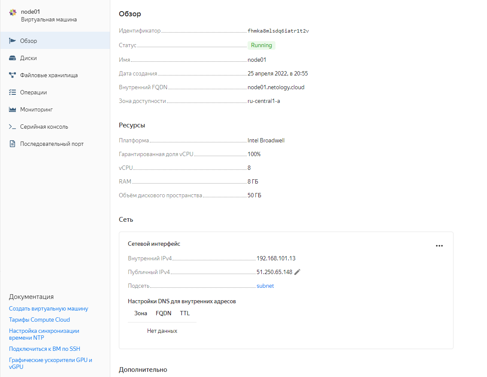
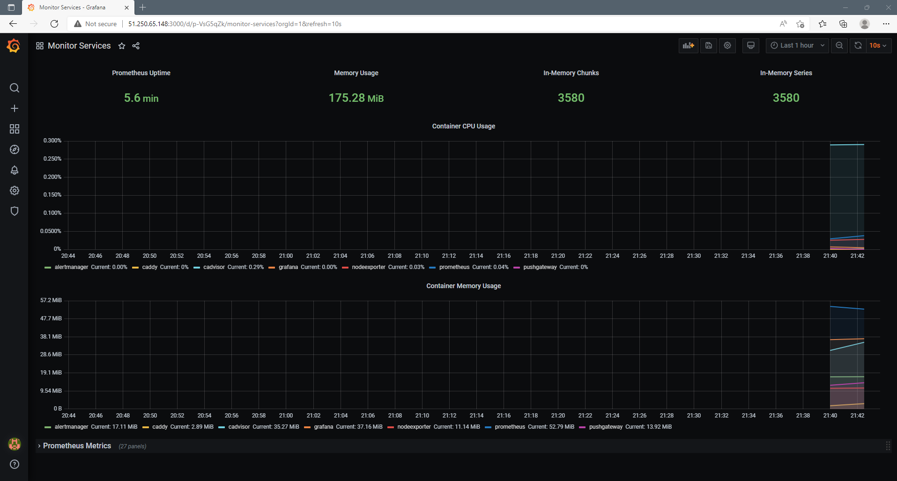
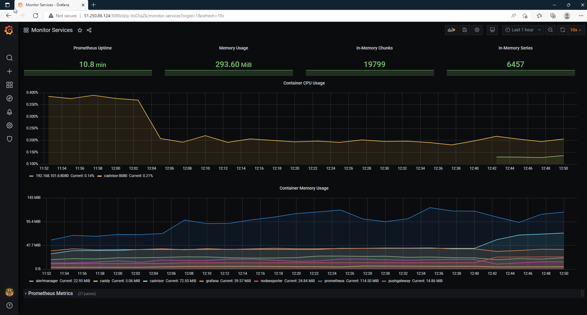

# Домашнее задание к занятию "5.4. Оркестрация группой Docker контейнеров на примере Docker Compose"

---

## Задача 1

Создать собственный образ операционной системы с помощью Packer.

```bash
vagrant@ubuntu-20:~/netology$ yc compute image list
+----------------------+---------------+--------+----------------------+--------+
|          ID          |     NAME      | FAMILY |     PRODUCT IDS      | STATUS |
+----------------------+---------------+--------+----------------------+--------+
| fd81ds52quhbkbtrf92p | centos-7-base | centos | f2esd9f5o5i9p7pkkk8k | READY  |
+----------------------+---------------+--------+----------------------+--------+
```

## Задача 2

Создать вашу первую виртуальную машину в Яндекс.Облаке.


## Задача 3

Создать ваш первый готовый к боевой эксплуатации компонент мониторинга, состоящий из стека микросервисов.


## Задача 4 (*)

Создать вторую ВМ и подключить её к мониторингу развёрнутому на первом сервере.



Создал вторую ВМ, добавил к ней контейнеры nodeexporter и cadvisor (с пробросом портов). Также изменил конфиг Prometheus, добавив метрики для второй ВМ.

```bash
[root@node02 stack]# docker-compose ps
    Name                  Command                  State               Ports
-------------------------------------------------------------------------------------
cadvisor       /usr/bin/cadvisor -logtostderr   Up (healthy)   0.0.0.0:8080->8080/tcp
nodeexporter   /bin/node_exporter --path. ...   Up             0.0.0.0:9100->9100/tcp

[root@node01 stack]# docker-compose ps
    Name                  Command                  State                                 Ports
------------------------------------------------------------------------------------------------------------------------
alertmanager   /bin/alertmanager --config ...   Up             9093/tcp
caddy          /sbin/tini -- caddy -agree ...   Up             0.0.0.0:3000->3000/tcp, 0.0.0.0:9090->9090/tcp,
                                                               0.0.0.0:9091->9091/tcp, 0.0.0.0:9093->9093/tcp
cadvisor       /usr/bin/cadvisor -logtostderr   Up (healthy)   8080/tcp
grafana        /run.sh                          Up             3000/tcp
nodeexporter   /bin/node_exporter --path. ...   Up             9100/tcp
prometheus     /bin/prometheus --config.f ...   Up             9090/tcp
pushgateway    /bin/pushgateway                 Up             9091/tcp
```
