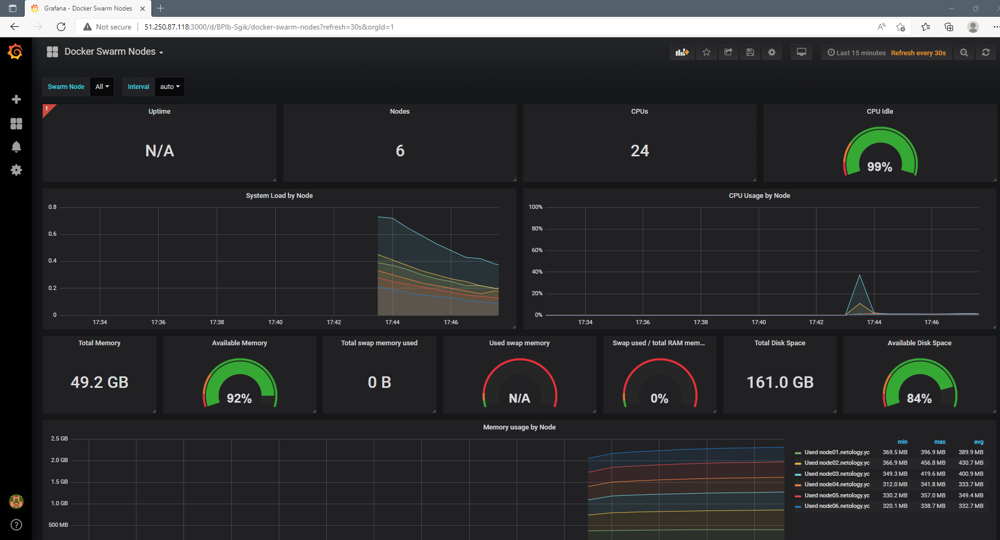
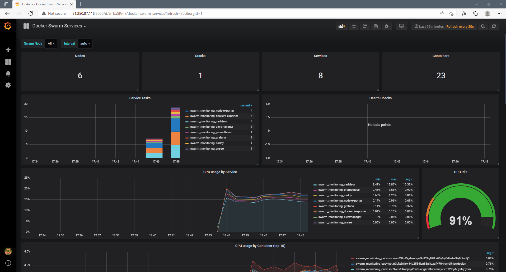

# Домашнее задание к занятию "5.5. Оркестрация кластером Docker контейнеров на примере Docker Swarm"

---

## Задача 1

Дайте письменые ответы на следующие вопросы:

#### В чём отличие режимов работы сервисов в Docker Swarm кластере: replication и global?
Для `replicated` сервисов мы указываем количество идентичных задач, которых хотим запустить. Swarm отслеживает текущее количество запущенных задач и в случае падения какой-либо ноды - запустит задачу на другой (поддерживает заданное количество реплик). \
`Global` сервис запускает одну задачу на каждой ноде. То есть при добавлении в кластер новых нод, глобальный сервис будет запущен и на ней автоматически
#### Какой алгоритм выбора лидера используется в Docker Swarm кластере?
Docker Swarm использует алгоритм консенсуса `Raft` для определения лидера. Этот алгоритм обеспечивает согласованное состояние кластера. Raft требует, чтобы большинство членов кластера согласились на изменение, и допускает `(N-1)/2`сбоев. 
В случае недоступности лидера, его роль берет на себя одна из нод-менеджеров (если за нее проголосовало большинство менеджеров). Реализуется это за счет таймаутов. Если в течение определенного времени менеджер не получил данные от лидера - он объявляет себя кандидатом и другие ноды голосуют за него. 
#### Что такое Overlay Network?
`Overlay` сеть - это сеть между несколькими демонами Docker. Она перекрывает сети хоста и позволяет контейнерам безопасно обмениваться данными (с использованием сертификатов и шифрования). Docker маршрутизирует пакеты к нужному хосту и контейнеру.
## Задача 2

Создать ваш первый Docker Swarm кластер в Яндекс.Облаке

```bash
[root@node01 ~]# docker node ls
ID                            HOSTNAME             STATUS    AVAILABILITY   MANAGER STATUS   ENGINE VERSION
2b6ncsnw8cudtd8w53dqcer2m *   node01.netology.yc   Ready     Active         Leader           20.10.14
4kazi5b0jbj2557vv2wks3uix     node02.netology.yc   Ready     Active         Reachable        20.10.14
rr3ukzjnjfrw14q2554jqn88a     node03.netology.yc   Ready     Active         Reachable        20.10.14
3wev11mfipqy2rw05aogzed1w     node04.netology.yc   Ready     Active                          20.10.14
mvz839xf5gdvmhqw9n229g898     node05.netology.yc   Ready     Active                          20.10.14
rxz44k39s74sjhujus979luia     node06.netology.yc   Ready     Active                          20.10.14
```

## Задача 3

Создать ваш первый, готовый к боевой эксплуатации кластер мониторинга, состоящий из стека микросервисов.

```bash
[root@node01 ~]# docker service ls
ID             NAME                                MODE         REPLICAS   IMAGE                                          PORTS
5goi2awkear2   swarm_monitoring_alertmanager       replicated   1/1        stefanprodan/swarmprom-alertmanager:v0.14.0
gbnufl8r3u0j   swarm_monitoring_caddy              replicated   1/1        stefanprodan/caddy:latest                      *:3000->3000/tcp, *:9090->9090/tcp, *:9093-9094->9093-9094/tcp
vxlvh7ac2coe   swarm_monitoring_cadvisor           global       6/6        google/cadvisor:latest
zuwny85hw9as   swarm_monitoring_dockerd-exporter   global       6/6        stefanprodan/caddy:latest
m6cctz6huh7a   swarm_monitoring_grafana            replicated   1/1        stefanprodan/swarmprom-grafana:5.3.4
nunj1k5djwx0   swarm_monitoring_node-exporter      global       6/6        stefanprodan/swarmprom-node-exporter:v0.16.0
yn34tihzzcx5   swarm_monitoring_prometheus         replicated   1/1        stefanprodan/swarmprom-prometheus:v2.5.0
q913te65vhgd   swarm_monitoring_unsee              replicated   1/1        cloudflare/unsee:v0.8.0
```


## Задача 4 (*)

Выполнить на лидере Docker Swarm кластера команду (указанную ниже) и дать письменное описание её функционала, что она делает и зачем она нужна:
```
# см.документацию: https://docs.docker.com/engine/swarm/swarm_manager_locking/
docker swarm update --autolock=true
```
Данная команда нужна для включения автоблокировки Swarm после перезагрузки ноды. \
Когда демон Docker перезапускается, ключи шифрования журналов Raft и ключи TLS для взаимодействия серверов загружаются в память каждой ноды. Чтобы защитить эти ключи, Docker может включить механизм блокировки ноды (по сути шифрование этих ключей). \
После активации данного механизма при перезагрузке ноды необходимо каждый раз вводить вручную ключ шифрования, чтобы нода успешно запустилась и продолжила работу в составе кластера.

```bash
[root@node01 ~]# docker swarm update --autolock=true
Swarm updated.
To unlock a swarm manager after it restarts, run the `docker swarm unlock`
command and provide the following key:

    SWMKEY-1-w6BeBd80OUteOZw1iGiURtieKUak2+aOSderhma43FA

Please remember to store this key in a password manager, since without it you
will not be able to restart the manager.

[root@node01 ~]# shutdown -r now

[root@node01 ~]# docker service ls
Error response from daemon: Swarm is encrypted and needs to be unlocked before it can be used. Please use "docker swarm unlock" to unlock it.

[root@node01 ~]# docker swarm unlock
Please enter unlock key:
[root@node01 ~]# docker service ls
ID             NAME                                MODE         REPLICAS   IMAGE                                          PORTS
5goi2awkear2   swarm_monitoring_alertmanager       replicated   1/1        stefanprodan/swarmprom-alertmanager:v0.14.0
gbnufl8r3u0j   swarm_monitoring_caddy              replicated   1/1        stefanprodan/caddy:latest                      *:3000->3000/tcp, *:9090->9090/tcp, *:9093-9094->9093-9094/tcp
vxlvh7ac2coe   swarm_monitoring_cadvisor           global       6/5        google/cadvisor:latest
zuwny85hw9as   swarm_monitoring_dockerd-exporter   global       6/5        stefanprodan/caddy:latest
m6cctz6huh7a   swarm_monitoring_grafana            replicated   1/1        stefanprodan/swarmprom-grafana:5.3.4
nunj1k5djwx0   swarm_monitoring_node-exporter      global       6/6        stefanprodan/swarmprom-node-exporter:v0.16.0
yn34tihzzcx5   swarm_monitoring_prometheus         replicated   1/1        stefanprodan/swarmprom-prometheus:v2.5.0
q913te65vhgd   swarm_monitoring_unsee              replicated   1/1        cloudflare/unsee:v0.8.0

```
