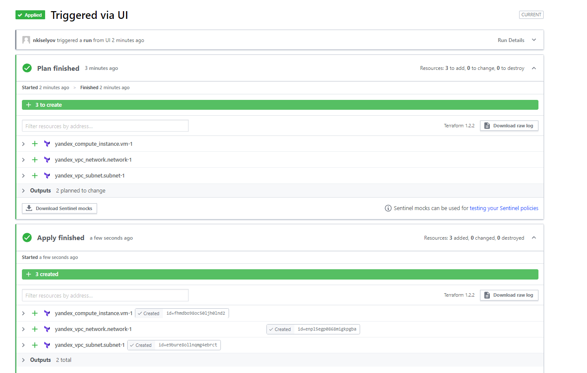
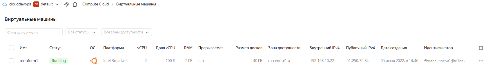

# Домашнее задание к занятию "7.4. Средства командной работы над инфраструктурой."

## Задача 1. Настроить terraform cloud (необязательно, но крайне желательно)

>В это задании предлагается познакомиться со средством командой работы над инфраструктурой предоставляемым
>разработчиками терраформа.
>
>1. Зарегистрируйтесь на [https://app.terraform.io/](https://app.terraform.io/).
>(регистрация бесплатная и не требует использования платежных инструментов).
>1. Создайте в своем github аккаунте (или другом хранилище репозиториев) отдельный репозиторий с
> конфигурационными файлами прошлых занятий (или воспользуйтесь любым простым конфигом).
>1. Зарегистрируйте этот репозиторий в [https://app.terraform.io/](https://app.terraform.io/).
>1. Выполните plan и apply.
>
>В качестве результата задания приложите снимок экрана с успешным применением конфигурации.




## Задача 2. Написать серверный конфиг для атлантиса

>Смысл задания – познакомиться с документацией
>о [серверной](https://www.runatlantis.io/docs/server-side-repo-config.html) конфигурации и конфигурации уровня
> [репозитория](https://www.runatlantis.io/docs/repo-level-atlantis-yaml.html).
>
>Создай `server.yaml` который скажет атлантису:
>
>1. Укажите, что атлантис должен работать только для репозиториев в вашем github (или любом другом) аккаунте.
>1. На стороне клиентского конфига разрешите изменять `workflow`, то есть для каждого репозитория можно
>будет указать свои дополнительные команды.
>1. В `workflow` используемом по-умолчанию сделайте так, что бы во время планирования не происходил `lock` состояния.
>
>Создай `atlantis.yaml` который, если поместить в корень terraform проекта, скажет атлантису:
>
>1. Надо запускать планирование и аплай для двух воркспейсов `stage` и `prod`.
>1. Необходимо включить автопланирование при изменении любых файлов `*.tf`.
>
>В качестве результата приложите ссылку на файлы `server.yaml` и `atlantis.yaml`.

[server.yaml](./src/server.yaml)

```yaml
repos:
- id: /github.com/nkiselyov/*/
  allowed_overrides: [workflow]
  allow_custom_workflows: true
  
workflows:
  default:
    plan:
      steps:
      - init
      - plan:
          extra_args: ["-lock", "false"]
    apply:
      steps:
      - apply
```

[atlantis.yaml](./src/atlantis.yaml)

```yaml
version: 3
parallel_apply: true
parallel_plan: true
projects:
- name: project1
  dir: .
  workspace: stage
  autoplan:
    when_modified: ["../modules/**/*.tf", "*.tf"]
    enabled: true
- name: project1
  dir: .
  workspace: prod
  autoplan:
    when_modified: ["../modules/**/*.tf", "*.tf"]
    enabled: true
```

## Задача 3. Знакомство с каталогом модулей

>1. В [каталоге модулей](https://registry.terraform.io/browse/modules) найдите официальный модуль от aws для создания
>`ec2` инстансов.
>2. Изучите как устроен модуль. Задумайтесь, будете ли в своем проекте использовать этот модуль или непосредственно
>ресурс `aws_instance` без помощи модуля?
>3. В рамках предпоследнего задания был создан ec2 при помощи ресурса `aws_instance`.
>Создайте аналогичный инстанс при помощи найденного модуля.
>
>В качестве результата задания приложите ссылку на созданный блок конфигураций.

[main.tf](./src/main.tf)

```jsonc
provider "aws" {
  region = "us-east-2"
}

module "ec2-instance" {
  source  = "terraform-aws-modules/ec2-instance/aws"
  version = "3.4.0"

  name = "vm-module-1"

  ami                    = "ami-ebd02392"
  instance_type          = "t2.micro"
  key_name               = "user1"
  vpc_security_group_ids = ["sg-12345678"]
  subnet_id              = "subnet-eddcdzz4"
  
  tags = {
    Terraform   = "true"
    Environment = "dev"
  }
}
```

Так как доступа к `AWS` на данный момент у меня нет, а для `YC` нет официальных модулей, то задание делал теоритически.

Использование модуля в моем проект основывалось бы на масштабе. Если мне необходимо развернуть пару-тройку ресурсов, то нет необходимости использовать модули. Если проект имеет сложную архитектуру с большим количеством зависимостей и ресурсов - то модули однозначно упростят работу и читаемость кода.

---
