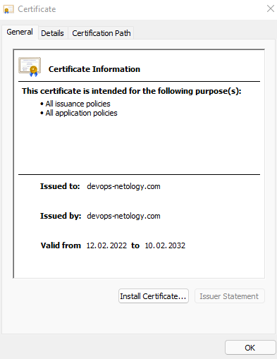
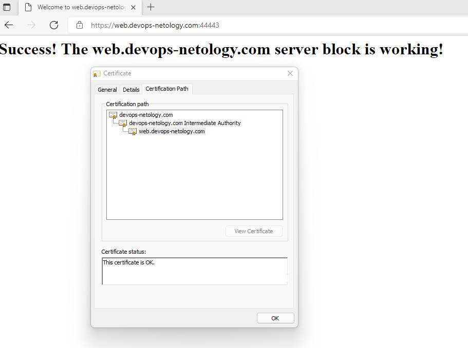

# Курсовая работа по итогам модуля "DevOps и системное администрирование"

1) Создайте виртуальную машину Linux.

Используем Vagrant

Vagrantfile
```properties
Vagrant.configure("2") do |config|
 	config.vm.box = "bento/ubuntu-21.10"
	config.vm.provider "virtualbox" do |v|
		v.memory = 2048
		v.cpus = 2
	end
 end
```
2) Установите ufw и разрешите к этой машине сессии на порты 22 и 443, при этом трафик на интерфейсе localhost (lo) должен ходить свободно на все порты.

```bash
vagrant@vagrant:~$ ufw --version
ufw 0.36.1
Copyright 2008-2021 Canonical Ltd.

vagrant@vagrant:~$ sudo ufw default deny incoming
Default incoming policy changed to 'deny'
(be sure to update your rules accordingly)
vagrant@vagrant:~$ sudo ufw default allow outgoing
Default outgoing policy changed to 'allow'
(be sure to update your rules accordingly)
vagrant@vagrant:~$ sudo ufw allow 22/tcp
Rules updated
Rules updated (v6)
vagrant@vagrant:~$ sudo ufw allow 443/tcp
Rules updated
Rules updated (v6)
vagrant@vagrant:~$ sudo ufw allow in on lo to any
Rules updated
Rules updated (v6)

vagrant@vagrant:~$ sudo ufw enable
Command may disrupt existing ssh connections. Proceed with operation (y|n)? y
Firewall is active and enabled on system startup

vagrant@vagrant:~$ sudo ufw status
Status: active

To                         Action      From
--                         ------      ----
22/tcp                     ALLOW       Anywhere
443/tcp                    ALLOW       Anywhere
Anywhere on lo             ALLOW       Anywhere
22/tcp (v6)                ALLOW       Anywhere (v6)
443/tcp (v6)               ALLOW       Anywhere (v6)
Anywhere (v6) on lo        ALLOW       Anywhere (v6)
```
3) Установите hashicorp vault
```bash
vagrant@vagrant:~$ curl -fsSL https://apt.releases.hashicorp.com/gpg | sudo apt-key add -

vagrant@vagrant:~$ sudo apt-add-repository "deb [arch=amd64] https://apt.releases.hashicorp.com $(lsb_release -cs) main"

vagrant@vagrant:~$ sudo apt-get update && sudo apt-get install vault

vagrant@vagrant:~$ vault --version
Vault v1.9.3 (7dbdd57243a0d8d9d9e07cd01eb657369f8e1b8a)
```
4) Cоздайте центр сертификации и выпустите сертификат для использования его в настройке веб-сервера nginx (срок жизни сертификата - месяц).

Разрешаем работу по HTTP. Для этого в конфиг файле расскомментируем настройки HTTP Listener и закомментируем HTTPS
```bash
vagrant@vagrant:~$ sudo nano /etc/vault.d/vault.hcl

# HTTP listener
listener "tcp" {
  address = "127.0.0.1:8200"
  tls_disable = 1
}

# HTTPS listener
#listener "tcp" {
#  address       = "0.0.0.0:8200"
#  tls_cert_file = "/opt/vault/tls/tls.crt"
#  tls_key_file  = "/opt/vault/tls/tls.key"
#}

vagrant@vagrant:~$ export VAULT_ADDR=http://127.0.0.1:8200
vagrant@vagrant:~$ sudo systemctl restart vault
vagrant@vagrant:~$ vault status
Key                Value
---                -----
Seal Type          shamir
Initialized        false
Sealed             true
Total Shares       0
Threshold          0
Unseal Progress    0/0
Unseal Nonce       n/a
Version            1.9.3
Storage Type       file
HA Enabled         false
```
Инициализируем сервер
```bash
vagrant@vagrant:~$ vault operator init
Unseal Key 1: EmvdWwy2POzHUaBOySMQ27YZfMIzs13GRPMqZBACz7iE
Unseal Key 2: 8HxQed1qaUw+Iv9bxSAhmEr/M7CwGvw4TfGAOgfxbml3
Unseal Key 3: Jm98Xomr/lVrR19MXn7aBkT/zsBDiwPPQ5Q+PlGIumwD
Unseal Key 4: 0V3VGC8urwrUEF99xLAAg1SOXoJY7CYCumYq6xnK5+82
Unseal Key 5: jT1kgHYmlXcp7qT4TNQQakgKPG22BwBvW9Rzgdw+kXmY

Initial Root Token: s.HUpO3gIQEzhSupDDYDKu6CN7

Vault initialized with 5 key shares and a key threshold of 3. Please securely
distribute the key shares printed above. When the Vault is re-sealed,
restarted, or stopped, you must supply at least 3 of these keys to unseal it
before it can start servicing requests.

Vault does not store the generated master key. Without at least 3 keys to
reconstruct the master key, Vault will remain permanently sealed!

It is possible to generate new unseal keys, provided you have a quorum of
existing unseal keys shares. See "vault operator rekey" for more information.

vagrant@vagrant:~$ vault operator unseal
vagrant@vagrant:~$ vault status
Key             Value
---             -----
Seal Type       shamir
Initialized     true
Sealed          false
Total Shares    5
Threshold       3
Version         1.9.3
Storage Type    file
Cluster Name    vault-cluster-bc430709
Cluster ID      1233742a-7fa7-9001-a5c1-3a91f6cf5c31
HA Enabled      false
```
Создаем Root CA
```bash
vagrant@vagrant:~$ vault login
vagrant@vagrant:~$ vault secrets enable pki
Success! Enabled the pki secrets engine at: pki/
vagrant@vagrant:~$ vault secrets tune -max-lease-ttl=87600h pki
Success! Tuned the secrets engine at: pki/
vagrant@vagrant:~$ vault write -field=certificate pki/root/generate/internal common_name="devops-netology.com" ttl=87600h > CA_cert.crt
vagrant@vagrant:~$ vault write pki/config/urls issuing_certificates="$VAULT_ADDR/v1/pki/ca" crl_distribution_points="$VAULT_ADDR/v1/pki/crl"
Success! Data written to: pki/config/urls
```
Создаем промежуточный сертификат
```bash
vagrant@vagrant:~$ vault secrets enable -path=pki_int pki
Success! Enabled the pki secrets engine at: pki_int/
vagrant@vagrant:~$ vault secrets tune -max-lease-ttl=43800h pki_int
Success! Tuned the secrets engine at: pki_int/
vagrant@vagrant:~$ vault write -format=json pki_int/intermediate/generate/internal common_name="devops-netology.com Intermediate Authority" | jq -r '.data.csr' > pki_intermediate.csr
vagrant@vagrant:~$ vault write -format=json pki/root/sign-intermediate csr=@pki_intermediate.csr format=pem_bundle ttl="43800h" | jq -r '.data.certificate' > intermediate.cert.pem
vagrant@vagrant:~$ vault write pki_int/intermediate/set-signed certificate=@intermediate.cert.pem
Success! Data written to: pki_int/intermediate/set-signed
```
Создаем роли. Разрешаем создание сертификатов для поддоменов нашего домена `devops-netology.com`
```bash
vagrant@vagrant:~$ vault write pki_int/roles/devops-netology.com allowed_domains="devops-netology.com" allow_subdomains=true max_ttl="720h"
Success! Data written to: pki_int/roles/devops-netology.com
```
Выпускаем сертификат для будущего веб-сервера
```bash
vagrant@vagrant:~$ vault write -format=json pki_int/issue/devops-netology.com common_name="web.devops-netology.com" ttl="720h" > web.json
vagrant@vagrant:~$ cat web.json | jq -r .data.certificate > web.pem
vagrant@vagrant:~$ cat web.json | jq -r .data.issuing_ca >> web.pem
vagrant@vagrant:~$ cat web.json | jq -r .data.private_key > web.key
```
5) Установите корневой сертификат созданного центра сертификации в доверенные в хостовой системе.



6) Установите nginx
```bash
vagrant@vagrant:~$ sudo systemctl status nginx
● nginx.service - A high performance web server and a reverse proxy server
     Loaded: loaded (/lib/systemd/system/nginx.service; enabled; vendor preset: enabled)
     Active: active (running) since Sat 2022-02-12 19:05:59 UTC; 39s ago
       Docs: man:nginx(8)
    Process: 1612 ExecStartPre=/usr/sbin/nginx -t -q -g daemon on; master_process on; (code=exited, status=0/SUCCESS)
    Process: 1613 ExecStart=/usr/sbin/nginx -g daemon on; master_process on; (code=exited, status=0/SUCCESS)
   Main PID: 1706 (nginx)
      Tasks: 3 (limit: 2288)
     Memory: 6.0M
        CPU: 29ms
     CGroup: /system.slice/nginx.service
             ├─1706 nginx: master process /usr/sbin/nginx -g daemon on; master_process on;
             ├─1708 nginx: worker process
             └─1709 nginx: worker process

Feb 12 19:05:59 vagrant systemd[1]: Starting A high performance web server and a reverse proxy server...
Feb 12 19:05:59 vagrant systemd[1]: Started A high performance web server and a reverse proxy server.
```
7) Настройте nginx на https, используя ранее подготовленный сертификат
```bash
vagrant@vagrant:~$ sudo mkdir -p /var/www/web.devops-netology.com/html
vagrant@vagrant:~$ sudo chown -R $USER:$USER /var/www/web.devops-netology.com/html
vagrant@vagrant:~$ sudo chmod -R 755 /var/www/web.devops-netology.com
vagrant@vagrant:~$ nano /var/www/web.devops-netology.com/html/index.html

<html>
    <head>
        <title>Welcome to web.devops-netology.com!</title>
    </head>
    <body>
        <h1>Success!  The web.devops-netology.com server block is working!</h1>
    </body>
</html>

vagrant@vagrant:~$ sudo nano /etc/nginx/sites-available/web.devops-netology.com

server {
        listen 443 ssl;

        ssl_certificate     /etc/nginx/ssl/web.pem;
        ssl_certificate_key /etc/nginx/ssl/web.key;
        ssl_protocols       TLSv1 TLSv1.1 TLSv1.2;
        ssl_ciphers         HIGH:!aNULL:!MD5;
        root /var/www/web.devops-netology.com/html;
        index index.html index.htm index.nginx-debian.html;

        server_name web.devops-netology.com www.web.devops-netology.com;

        location / {
                try_files $uri $uri/ =404;
        }
}

vagrant@vagrant:~$ sudo ln -s /etc/nginx/sites-available/web.devops-netology.com /etc/nginx/sites-enabled/
```
8) Откройте в браузере на хосте https адрес страницы, которую обслуживает сервер nginx.

